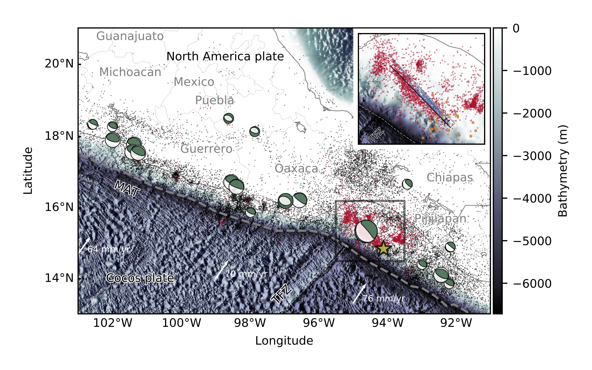
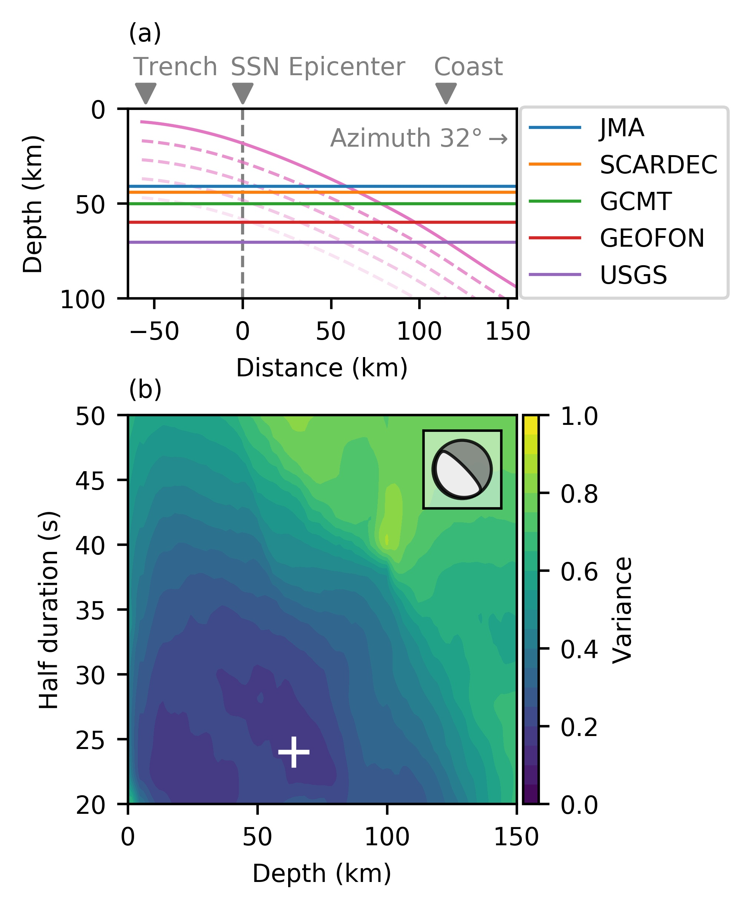
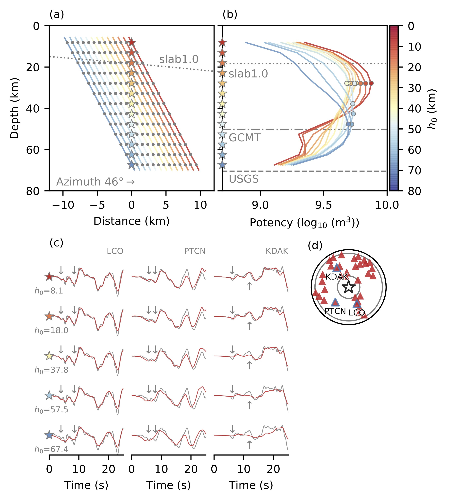
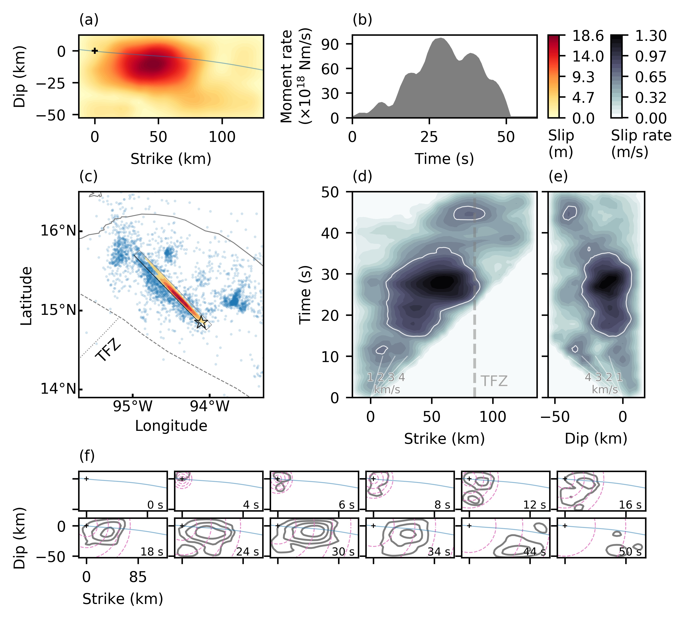

This archive follows the rule of [Wiley's Self-Archiving Policy](https://authorservices.wiley.com/author-resources/Journal-Authors/licensing-open-access/open-access/self-archiving.html).

# Rupture Process during the Mw 8.1 2017 Chiapas Mexico Earthquake: Shallow Intraplate Normal Faulting by Slab Bending

[Ryo Okuwaki](https://rokuwaki.github.io) & [Yuji Yagi](http://www.geol.tsukuba.ac.jp/~yagi-y/eng/index.html)

- Corresponding author: Ryo Okuwaki ([rokuwaki@geol.tsukuba.ac.jp](mailto:rokuwaki@geol.tsukuba.ac.jp))

- Accepted 2017-11-19. Revision submitted 2017-11-15. Initial submission 2017-10-06.

# Abstract

A seismic source model for the Mw 8.1 2017 Chiapas, Mexico, earthquake was constructed by kinematic waveform inversion using globally observed teleseismic waveforms, suggesting that the earthquake was a normal-faulting event on a steeply dipping plane, with the major slip concentrated around a relatively shallow depth of 28 km. The modeled rupture evolution showed unilateral, down-dip propagation northwestward from the hypocenter, and the down-dip width of the main rupture was restricted to less than 30 km below the slab interface, suggesting that the down-dip extensional stresses due to the slab bending were the primary cause of the earthquake. The rupture front abruptly decelerated at the northwestern end of the main rupture where it intersected the subducting Tehuantepec Fracture Zone, suggesting that the fracture zone may have inhibited further rupture propagation.

# Contents

- [Submitted manuscript (preprint)](./doc/submittedmanuscript.pdf) (PDF: 693 KB)

- [Supporting information](./doc/818741_1_supp_5194921_gzg4xh_convrt.pdf) (PDF: 6.41 MB)

- [SAC files used in this study](./SACfiles)

- Slip model shown in Figure 4 ([fsp format file](./data/s2017CHIAPA01OKUW.fsp)/[Summary figure](./fig/map_slip_upload.png))

- [Data for figures](./data)

- [Jupyter-notebook](./fig.ipynb)

- [Figures](./fig)

Fig. 1

Fig. 2

Fig. 3

Fig. 4

