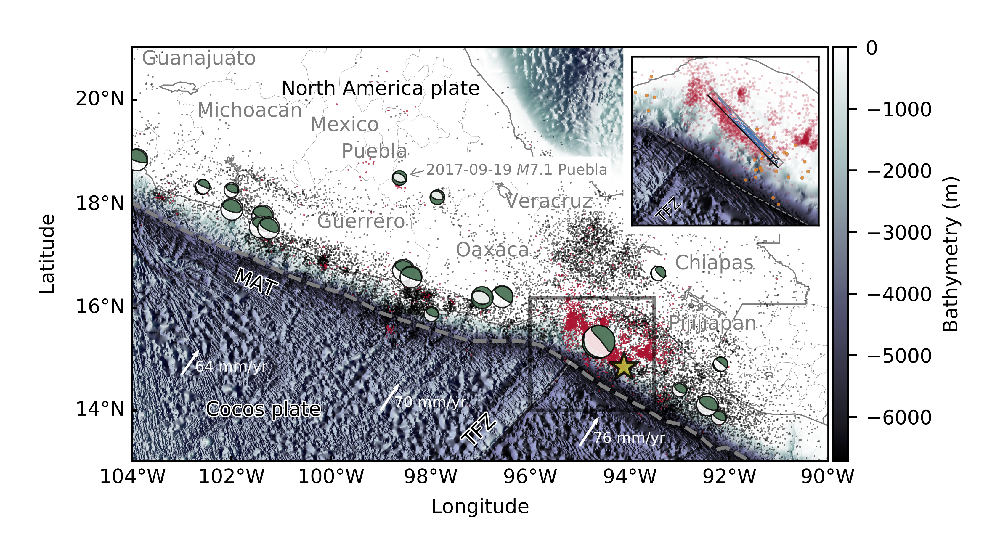

Submitted for publication in *Geophysical Research Letters* on October 6, 2017 at 08:34:50 (UTC-4).

# Rupture Process during the Mw 8.1 2017 Chiapas Mexico Earthquake: Shallow Intraplate Normal Faulting by Slab Bending</h1>

[Ryo Okuwaki](https://rokuwaki.github.io) & [Yuji Yagi](http://www.geol.tsukuba.ac.jp/~yagi-y/eng/index.html)

- Corresponding author: Ryo Okuwaki ([rokuwaki@geol.tsukuba.ac.jp](mailto:rokuwaki@geol.tsukuba.ac.jp))

# Contents

- [Submitted manuscript](./doc/submittedmanuscript.pdf) (PDF: 1.1MB)

- [Supporting information](./doc/818741_0_unknown_upload_5100358_vxvv4k_convrt.pdf) (PDF: 9.2MB)

- [SAC files](./SACfiles)

- Slip model ([fsp format file](./s2017CHIAPA01OKUW.fsp)/[Summary figure](./fig/map_slip_upload.png))

- [Data for figures](./data)

- [Jupyte-notebook](./fig.ipynb)

- [Figures](./fig)

Fig. 1

Fig. 2

Fig. 3

Fig. 4

